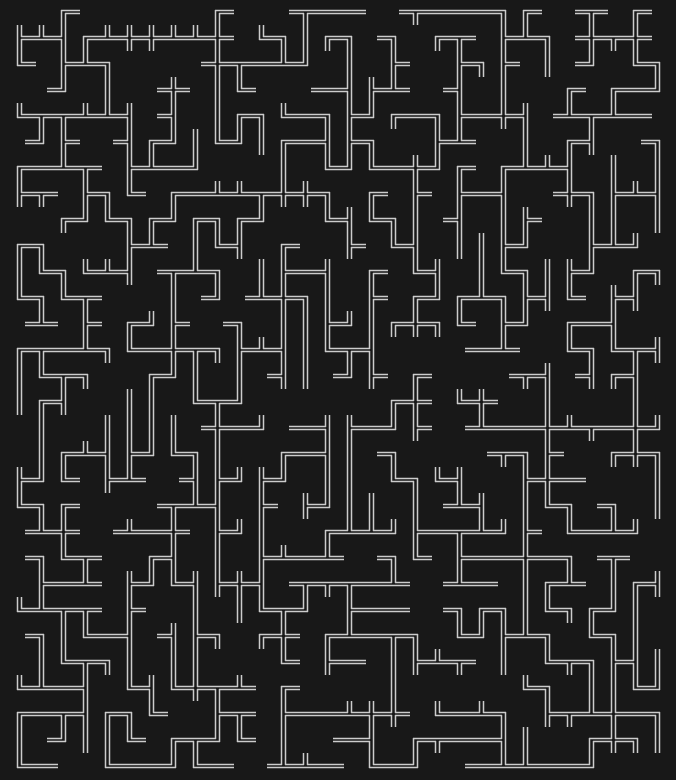
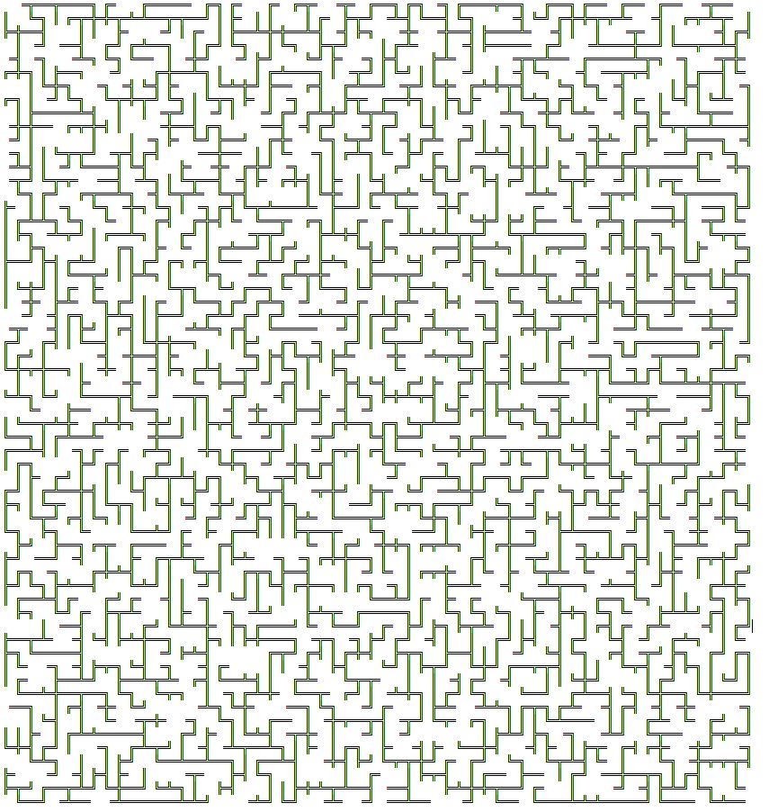
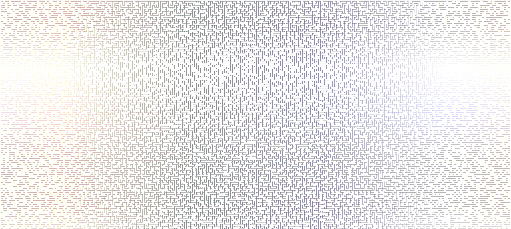

# Concurrent-Maze-Sover
___
## Project Description:

This project is a college assignment in which I create a concurrent application in C to solve a maze.

We also generate mazes using the Markov Chain Montecarlo method, which I discovered through [here](https://www.youtube.com/watch?v=zbXKcDVV4G0). And through the Hillbert Lookahead method, which I discovered through [here](https://www.youtube.com/watch?v=GTz6BEGs6zE), [and here](https://www.youtube.com/watch?v=O2Xy6mwnYfk). Also used this sources: [1](https://www.youtube.com/watch?v=3s7h2MHQtxc), [2](https://en.wikipedia.org/wiki/Hilbert_curve).

The goal is not to necessarly explore the maze faster, but to study the behaviour of our concurrent exploration algorithm, as explained later in this description.
___
## The Algorithm

Before we define the algorithm, first some things need to be established:
* The maze is a $M \times N$ matrix with each position being a struct that holds what are the directions (North, East, South or West), one can move towards in the next step if they are on that position.

* We have a defined number of worker threads that explore the maze as needed (details below).

* We divide the matrix in smaller sections that are $m \times n$. Each one of those sections has a mutex variable for mutual exclusion during the exploration.

Now, to the definition:

First, we create all $W$ worker threads, and send $W-1$ of them to sleep. The one remaining worker thread starts exploring the matrix in some vertex $(x_0,y_0)$. Whenever a woke worker thread finds some vertex in which it can take more than one action, i.e. there is more than one unexplored open direction, it trys to awaken enough worker threads to explore all the directions it won't be able to, and proceeds to explore one of those direction to which it didn't allocate another worker thread. If the worker thread fails to awaken another thread, the next vertex in the failed path is marked as explored and is put in a FI-FO Queue, to be explored by another worker thread later. Before moving from a vertex to another, the worker thread marks that vertex as explored. Whenever a worker thread cannot move to any direction whatsoever, it stops and goes to sleep. A sleeping thread is awakened when the Queue of unexplored paths is not empty. When any thread finds the exit to the maze, all threads stop.

___
## Examples:
Example of 30x30 maze with 9000 iterations for the MCMC method:

Example of 60x60 maze with 216000 iterations for the MCMC method:

Example of a 256X256 maze generated using the Hillbert Lookahead method (cutout):

___

## Compile and run

´´´sh
# in the root directory
mkdir build

make tests

./build/tests
´´´
